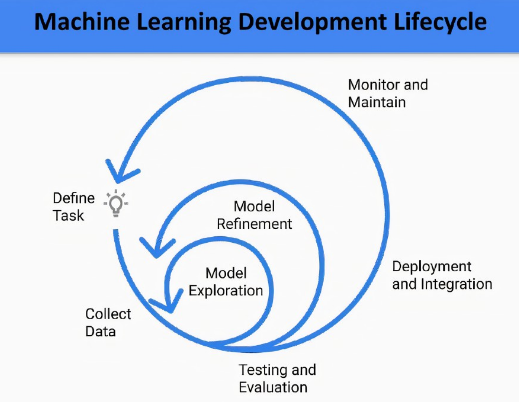
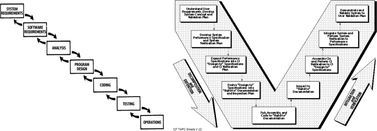

	  

<h1>Engenharia de Software em Machine Learning</h1>

- [Introdução](#introdução)
  - [Computação em nuvem](#computação-em-nuvem)
  - [APIs](#apis)
- [Princípios de Engenharia de Software](#princípios-de-engenharia-de-software)
- [Modelos de Processo de software](#modelos-de-processo-de-software)
- [Metodologia genérica](#metodologia-genérica)
  - [Modelos de Maturidade](#modelos-de-maturidade)
  - [Metodologias de desenvolvimento](#metodologias-de-desenvolvimento)
  - [Padrões de Processo](#padrões-de-processo)
- [Estudo de caso](#estudo-de-caso)
- [Desenvolvimento Ágil](#desenvolvimento-ágil)
  - [Extreme Programming (XP)](#extreme-programming-xp)
- [Testes que dever ser realizados com modelos de machine learning](#testes-que-dever-ser-realizados-com-modelos-de-machine-learning)
- [Modelagem de Software](#modelagem-de-software)
  - [Princípios de Comunicação](#princípios-de-comunicação)
  - [Princípios de Planejamento (definição)](#princípios-de-planejamento-definição)
  - [Princípios de Modelagem (mapa da mina)](#princípios-de-modelagem-mapa-da-mina)
  - [Princípios de Desenvolvimento](#princípios-de-desenvolvimento)
- [Engenharia de Requisitos](#engenharia-de-requisitos)
  - [Levantamento de requisitos](#levantamento-de-requisitos)
- [Para saber mais](#para-saber-mais)
- [Crédito das imagens](#crédito-das-imagens)
- [Contato](#contato)

---

## Introdução

Profissionais que trabalham com dados

- Cientista de dados: quem faz as análises dos dados, grande conhecimento em estatística e matemática
- Engenheiro de dados: quem cuida da infraestrutura para que se possa trabalhar com os dados
- Engenheiro de software: quem transforma os algoritmos em um programa utilizável
- Engenheiro de Machine Learning: conhece de forma generalista todas as outras funções. Como um FullStack developper.

Natureza do software

A evolução dos softwares revolucionou o mundo. Mas tudo isso é desenvolvido por alguém.
Machine Learning é desenvolvimento de software?
Sim! O resultado de do algoritmo de aprendizado de máquina é entregue para como um software que será consumido por um computador (smartphone, computadores, reloógios, IoT, etc.).
Machine Learning serve para resolver um problema, enquanto a estatística cuida da análise dos dados.

Aplicações de Software

Os modelos de MachineLearning não são entregáveis, para que o usuário final utilize o modelo, é necessário uma forma que o usuário consuma:

- uma API para outro sistema
- um app web
- um app móvel

Machine Learning é o backend. Não devememos pensar somente no software, temos que pensar na interface, nas integrações, na segurança, etc.

Tipos de software

- Software de Sistema
- Software de Aplicação (uso intensivo de regra de negócio)
- Software de IA
- Software de Engenharia/Científico
- Software de Embarcado (trechos de código em eletrodomésticos,por ex.)
- Software de para linhas de produto
- Software de para aplicações Web
- Software de para aplicações mobile

### Computação em nuvem

Normalmente, o usuário final não tem acesso ao modelo de machine learning, e sim à aplicação. Usar a computação é uma ideia inteligente para disponibilizar o web ou mobile app para usuários finais. A intraestrutura em nuvem pode ser mais ou menos complexa a depender da tecnologia utilizada e/ou da regra de negócio envolvida

- Front-End e Back-End no mesmo servidor ou em servidores diferentes
- Comunicação com o modelo através de RPC ou REST APIs.
- Uso ou não de banco de dados
- Uso ou não de redes privadas
- Nível de segurança

### APIs

API é um software que permite mascarar a solução de algum problema específico. Ela determina o que e quem pode acessar na aplicação ou no modelo de machine learning.

## Princípios de Engenharia de Software

- **Rigor e Formalidade:** Por mais que se use a criatividade, mas o rigor deve ser sempre respeitado (ex, posso somar de diversas maneira, desde que o resultado da soma respeite rigorosamente a regra matemática)
- **Separação de interesses:** (dividir e conquistar)
- **Modularidade:** Facilita a leitura, manutençao e alteração do programa
- **Alta coesão:** Os módulos devem ser coesos entre si, pensados no funcionamento do todo
- **Baixo acoplamento:** Cada módulo deve ser independente do todo
- **Abstração:** Pensar no resultado, antes de escrever qualquer linha de código
- **Antecipação à mudanças:** Criar planos e métodos para atualização constante
- **Generalidade:** A solução pode ser reaproveitada (custo x performance)
- **Incrementação:** Após o lançamento, os usuários clamam por aumento de funcionalidades
- **Requisitos de software:** Os requisitos mudam conforme a evolução do software

## Modelos de Processo de software

- Sequencial ou Cascata (WaterFall)
- Desenvolvimento Iterativo e Incremental (desenvolvimento de um subconjunto de requisitos do software)
- Evolucional ou Prototipação
- V-model 
- Espiral (epecificação > projeto > desenvolvimento)
- Compenentizado (DataOps)
- Formal (implementação através de um modelo matemático)
- Ágil
- RAD (Rapid Application Development)
- Quarta geração

## Metodologia genérica

- [ ] Comunicação (e Documentação)
- [ ] Planejamento
- [ ] Modelagem (MVP, protótipo)
- [ ] Construção (Aqui é onde começa a escrita de código)
- [ ] Entrega

### Modelos de Maturidade

Visa avaliar se a empresa está utilizando o software da melhor forma possível.

- CMMI (Capavility Maturity Model Integration)
- MPS.BR (Melhoria de Processos do Software Brasileiro)

### Metodologias de desenvolvimento

São as ferramentas que são utilizadas para o desenvolvimento do software

- Metodologia Estruturada
  - Análise estruturada
  - Projeto estruturado
  - Programação estruturada
  - Análise essencial
  - DPD (Diagrama de Fluxo de Dados)
  - MER (Modelo de Entidades e Relacionamentos)
- Metodologia Orientada a Objetos
  - Orientação a Objetos
  - RUP (Rational Unified Process)
- Desenvolvimento Ágil de Software
  - FDD (Feature Driven Development)
  - EUP (Enterprise Unified Process)
  - Scrum
  - Crystal
  - XP (xtreme programming)

**Modelo Cascata**

> O modelo de cascata não é o ideal em ML porque demoramos muito a descobrir nossas falhas. Não é ideal caso fôssemos desenvolver uma aplicação ou modelo do zero, mas pode ser interessante caso necessitemos apenas de um módulo ou pequena alteração no sistema.

- [ ] Comunicação
  - [ ] Início do planejamento
  - [ ] Levantamento de requisitos
- [ ] Planejamento
  - [ ] Estimativas
  - [ ] Cronograma
  - [ ] Acompanhamento
- [ ] Modelagem
  - [ ] Análise
  - [ ] Projeto
- [ ] Construção
  - [ ] Código
  - [ ] Teste
- [ ] Entrega
  - [ ] Suporte
  - [ ] Feedback

**Modelos de Processo Incremental**

Delita-se um escopo amplo, e libera para o cliente diversos incrementos de forma progressiva. Modelo interessante para casos de tempo e/ou equipe reduzidos. 

> Este modelo não faz sentido para aplicações de Machine Learning, visto que não é possível entregar uma parte da previsão.

**Modelos de Processo Evolucionário**

Desenvolvimento de protótipos que são alterados a cada feedback. Modelo interessante para processos de desenvolvimento de Machine Learning, pois interage com o usuário final e com as regras de negócio.

**Desenvolvimento baseado em componentes**

1. Produtos baseados em componentes disponíveis são avaliados para o campo da aplicação em questão
2. Itens de integração de componentes são considerados
3. Arquitetura de software é projetada para a acomodação de componentes (microsserviços)
4. Componentes são integrados à arquitetura
5. Testes completos realizados para garantir funcionalidade

> Estratégia pode ser considerada caso a empresa em questão utilize softwares baseados em componentes.

**Desenvolvimento Orientado a Objetos**

Não é bem um modelo de desenvolvimento, mas um paradigma de programação.Porém o seu escopo é tão amplo que serve como modelo de desenvolvimento de software.

Neste modelo o mundo real é abstraído e modelado para dentro do programa.

### Padrões de Processo

A tecnologia resolve um problema e cria mais alguns outros.

- SCAMPI (Standard CMMI Assesmento Method for Process Inprovement)
- CBA IPI (CMM-Based Appraisal for Internal Process Imrprovement)
- SPICE (ISO/IECD 15.504)
- ISO 9007:2000

## Estudo de caso

Considere uma aplicação baseada em Machine Learning para classificação de texto. Nossa aplicação deve receber um arquivo de texto de até duas páginas e devolver como previsão o sentimento que o autor transmite no texto: 

- positivo,
- negativo ou
- neutro

Usando a Estrutura de Processo de Software apresentada a você neste capítulo, defina as 5 atividades necessárias para o desenvolvimento da aplicação.

## Desenvolvimento Ágil

> Estamos descobrindo maneiras melhores de desenvolver software, fazendo-o nós mesmos e ajudando outros a fazerem o mesmo. Através deste trabalho, passamos a valorizar:
> - Indivíduos e interações mais que processos e ferramentas
> - Software em funcionamento mais que documentação abrangente
> - Colaboração com o cliente mais que negociação de contratos
> - Responder a mudanças mais que seguir um plano
> 
> Ou seja, mesmo havendo valor nos itens à direita, valorizamos mais os itens à esquerda.
> 
> [**Manifesto para Desenvolvimento Ágil de Software**](http://agilemanifesto.org/iso/ptbr/manifesto.html)

**O desenvolvimento ágil não se aplica à todos os processos de desenvolvimento de software.** Para Engenharia de Machine Learning cai como uma luva, para sistemas complexos como ERPs pode trazer mais dores de cabeça do que soluções.

**Processo Ágil**

- Um artefato é um incremento operacional entregue ao cliente. (o foco é a satisfação do cliente, e não o artefato em si)
- Se a equipe e o cliente concordam com a entrega, então está correto

### Extreme Programming (XP)

Desenvolvimento Ágil é um modelo de processo de software, e dentre as diversas técnicas que são utilizadas dentro deste modelo, destaca-se a XP, que é uma metodologia orientada à objetos.

- [ ] Planejamento
  - [ ] histórias de usuários
    - valores
    - critérios de aceitação
  - [ ] plano de iteração
- [ ] Projeto
  - cartões CRC
  - projeto simples (KISS - keep it simple, stupid)
  - soluções pontuais
    - protótipos
- [ ] Codificação
  - Teste de unidades
  - Pair Programming
  - Refatoração
- [ ] Teste
  - Testes de Unidade
  - testes de aceitação
  - integração contínua
- [ ] Versão entregue
  - Incremento de software
  - velocidade do projeto calculada

## Testes que dever ser realizados com modelos de machine learning

- [ ] Testes de avaliação (precisão, RMSE, etc.)
- [ ] Verificação da distribuição da previsão
- [ ] Verificação da distribuição de recursos importantes comparados com testes anteriores
- [ ] Análise de importância de recuros e mudanças
- [ ] Análise de sensibilidade para ruídos aleatórios/extremos
- [ ] Teste de estresse do modelo
- [ ] Viés e discriminação
- [ ] erro de rotulagem e verificação de qualidade
- [ ] Verificar vazamento de dados
- [ ] Verificar ajuste excessivo ou insuficiente
- [ ] Backtesting em dados históricos para comparar resultados
- [ ] Testes de pipeline de recursos

## Modelagem de Software

- Antes de se comunicar, tenha certeza do que compreendeu o ponto de vista do outro. Saber ouvir é uma arte.
- Pergutas e repostas simples são o caminho mais curto para a maioria dos problemas
  
### Princípios de Comunicação

1. Ouça
2. Prepare-se
3. Facilite
4. Personalize (chame pelo nome, pergunte o ponto de vista da pessoa)
5. Documente
6. Colabore (evite barreiras, reme na mesma direção de todos. Senso de comunidade)
7. Foque (discuta APENAS aquilo que é importante para o projeto)
8. Desenhe (clareza "quer que eu desenhe...?")
9. Avance
10. Negocie

### Princípios de Planejamento (definição)

1. Escopo (Documente!)
2. Envolvidos (Traga todos para o projeto)
3. Iteratividade (cenários mudam)
4. Estimativas
5. Riscos (mitigação e preparação)
6. Realismo
7. Detalhes
8. Qualidade
9. Mudanças (tecnológicas, sociais, humanas)
10. Ajustes

### Princípios de Modelagem (mapa da mina)

1. Softwares (o modelo não é o objetivo, e sim o software)
2. Objetividade (somente os requisitos do escopo)
3. Simplicidade
4. Alterações
5. Propósito
6. Adaptação
7. Utilidade
8. Representação (não existe perfeição)
9. Correção
10. Feedback

### Princípios de Desenvolvimento

> Cuidado para não criar soluções elegantes que resolvem o problema errado

1. Compreensão
2. Programação
3. Restrição (se não foi pedido/planejado, não o faças)
4. Lógica
5. Documentação
6. Layout (clean code)
7. Revisão (idealmente, quem desenvolve não deve revisar e nem testar o código)
8. Teste
9. Entrega
10. Suporte (recomendado incluir x horas de suporte no projeto)

## Engenharia de Requisitos

> Identifique os envolvidos (não é porque a pessoa disse que queria de determinado modo, que ela saiba o modo que ela quer)

### Levantamento de requisitos

O levantmento de requisitos combina:

- Elementos de solução de problemas
- Elaboração
- Negociação
- Especificação

**Coleta Colaborativa de Requisitos**

- Reuniões com a participação de todos os envolvidos
- Estabelecer regras para a preparação e participação
- É sugerida uma agenda formal para pontos importantes, mas não engessada ao ponto de bloquear o fluxo de ideias
- Um facilitador dirige a renião
- Documente as reuniões
  
**Quality Function Deployment**

- Requisitos esperados podem estar implícitos no produto ou sistema podem ser tão básicos que às vezes o cliente nem os cita.

## Para saber mais

- Engenharia de Software, Ian Sommerville
- Engenharia de Software, Roger Pressman e Bruce Maxim
- Métodos Ágeis para Desenvolvimento de Software, Rafael Prikladnicki

## Crédito das imagens
 
 - Gordon Johnson, in Pixabay. Originais: [Aqui](https://pixabay.com/pt/vectors/c%c3%a9rebro-computador-a-eu-ai-3199838/) e [Aqui](https://pixabay.com/pt/vectors/a-eu-ai-anatomia-2729781/).
 - Machine Learning Lifecycle, by Ramjee Ganti, dblue Inc.
 - Goring, Markus & Fay, Alexander. (2013). Method for the analysis of temporal change of physical structure in the instrumentation and control life-cycle. Nuclear Engineering and Technology. 45. 10.5516/NET.04.2013.010.

---
<!-- CONTACT -->
## Contato

**Author:** Jonas Araujo de Avila Campos

**Confira mais projetos: [AQUI](https://jonasaacampos.github.io/portfolio/)**

  
  

