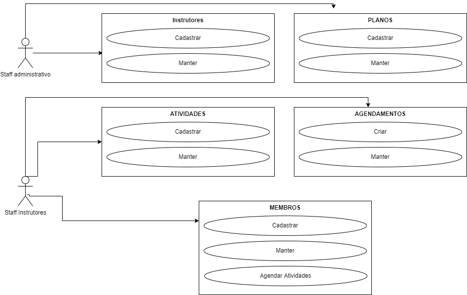

<p align="center">
	  <a href='https://jonasaacampos.github.io/portfolio/'>
      
      </a>
</p>


<h1>Gerenciador de academia com Flask e PostgreSql com Docker</h1>


Aplicação web para gerência de academia desenvolvido como requisito para obtenção do título de Engenheiro de dados da DS Academy.

[](https://jonasaacampos.github.io/portfolio/)
[](https://www.linkedin.com/in/jonasaacampos)

## Table of Contents

- [Table of Contents](#table-of-contents)
- [Softwares utilizados](#softwares-utilizados)
- [Definição de Web App](#definição-de-web-app)
- [Guia de Implementação](#guia-de-implementação)
- [Diagrama comportamental (casos de uso)](#diagrama-comportamental-casos-de-uso)
- [Diagrama de Classes](#diagrama-de-classes)
- [Criando e configurando ambiente/infraestrutura](#criando-e-configurando-ambienteinfraestrutura)
  - [Configurando banco de dados](#configurando-banco-de-dados)
  - [Carregar massa de dados para teste](#carregar-massa-de-dados-para-teste)
  - [Criar conexão e conectores com o banco de dados](#criar-conexão-e-conectores-com-o-banco-de-dados)
- [Deploy](#deploy)
- [To do ☑️](#to-do-️)
- [Contato](#contato)

## Softwares utilizados

- [ ] PostgreSQL com Docker
- [ ] Python com Anaconda
- [ ] Flask
- [ ] Html/CSS para Front-End

## Definição de Web App

- Web App são software que são executadas via navegador 
- É construído com tecnologias web (HTML, CSS e JS) que manipulada dados via CRUD, e é usado pelo usuário para realizar tarefas via navegador
- CRUD é o centro do desenvolvimento de aplicações web, e significa: Criar, Ler, Atualizar e Excluir
- Web App são definidas pela sua entrada, Web Sites são definidos por sua saída.

## Guia de Implementação

- [ ] Concepção do problema e Ideia para solução
  - [ ] Definição do problema
  - [ ] Proposta de solução
  - [ ] Pesquisa de mercado
- [ ] Desing
  - [ ] Protótipo da APP
  - [ ] Wireframe da UI
  - [ ] Planejamenot do fluxo da operação
- [ ] Desenvolvimento
  - [ ] Arquitetura do banco de dados
  - [ ] Desenvolvimento do BackEnd
  - [ ] Desenvolvimento do FrontEnd
- [ ] Implementação
  - [ ] Deploy
  - [ ] Segurança
  - [ ] Testes e Validação


| Fase               |   |
|---                 |---|
| Concepção          | - Melhorar Gerência da Academia<br/>- Desenvolvimento de uma web app personalizada<br/>- Já existem aplicações similares no mercado (glofox, pike13) mas seu escopo vai além das necessidades do cliente  |
| Design             |   |
| Desenvolvimento    |   |
| Implementação      |   |

Requisitos

MVP - Possibilidade de:
 - Criar e editar membros
 - Criar e editar atividades
 - Criar e editar instrutores
 - Agendar membros nas atividades
 - listar as próximas atividades
 - listar membros agendados para determinada atividade

## Diagrama comportamental (casos de uso)



## Diagrama de Classes


## Criando e configurando ambiente/infraestrutura

- [Instalar o Docker](https://www.docker.com/get-started/)
- [Instalar a imagem do Postgres](https://hub.docker.com/_/postgres)
- Iniciar o container do Porsgres
  - `docker run --name dbapp -e POSTGRES_PASSWORD=123@Mudar -d -p 5432:5432 postgres`
- Verificar se container foi inicializado corretamente
  - `docker ps`
- Para para inciar o container
  - `docker stop dbapp`
  - `docker start dbapp`
- [Instalar o pgAdmin](https://www.pgadmin.org/download/)
- Configurar senha master e o acesso ao servidor
  - Servers > Create > Server
  - General > Name: Local
  - Connection > Hostname: localhost
  - Inserir e salvar a senha
- Criar o banco de dados
  - Databases > Create > Database
  ```
  CREATE DATABASE dbapp
    WITH
    OWNER = postgres
    ENCODING = 'UTF8'
    CONNECTION LIMIT = -1
    IS_TEMPLATE = False;
  ```
### Configurando banco de dados

**Boas Práticas:**

- NÃO USE A TABELA postgres, crie uma nova
- NÃO USE o Schema public, crie um novo

1. Crie o um novo Schema com o nome de webuser
2. Crie as tabelas dentro do Schema via interface Gráfica ou via Query Toll (scrip para criação [aqui](database/tabelas_academia.sql)).

### Carregar massa de dados para teste

Utilizar os dados de teste disponível [aqui](jonasaacampos/Engenharia-de-Software-em-Machine-Learning/Projeto-01/database/test-data).

### Criar conexão e conectores com o banco de dados

- [Executor](database/run_sql.py)
- [Conectores](database/conectores)

> Os conectores não foram inseridos dentro das classes para facilitar futuras manuteções e reuso dos conectores em outras aplicações.

## Deploy

`flask run`

## To do ☑️

- [ ] Criar Documentação de casos de uso
- [ ] Testar aplicação
- [ ] Inserir token secreto para banco de dados
- [ ] Remover senha master banco de dados no arquivo `database > run_sql.py`
- [ ] Rodar script de limpeza de banco de dados `database > test-data > clean-data.sql`

---
<!-- CONTACT -->
## Contato

**Author:** Jonas Araujo de Avila Campos

**Confira mais projetos: [AQUI](https://jonasaacampos.github.io/portfolio/)**

<p align='center'>
  <a href='https://github.com/jonasaacampos'>
    
  </a>
  <a href='https://www.linkedin.com/in/jonasaacampos/'>
    
  </a>
</p>
